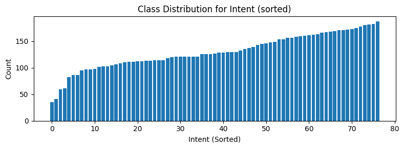
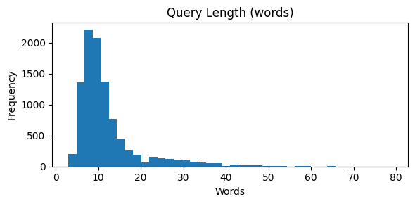
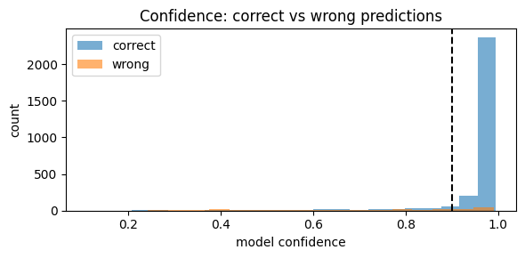

# Banking Intent Classification with Confidence-Based Routing

> Fine-tuning DistilBERT to route customer banking queries across 77 intents, and working out *when the model should answer and when it should hand off to a human*.

**Author:** Kamlesh Shrestha

## Summary

I fine-tuned DistilBERT to classify online banking queries into 77 intents. It reaches **92.6% accuracy and macro-F1** on a held-out test set, against 88.5% for a TF-IDF baseline. The model is overconfident, though: about 27% of its errors come with ≥ 90% confidence. I therefore tuned a confidence threshold so that the system **automates about 80% of queries at a 1.6% error rate** and hands the remaining 20% to human agents.

**Stack:** Python · PyTorch · Hugging Face Transformers & Datasets · scikit-learn · pandas · matplotlib · SciPy

---

## Business problem

Banks increasingly put an automated assistant in front of customer support. It maps a free-text query to an operational category (lost card, failed transfer, top-up, and so on) before the query is resolved or assigned to the right team. At scale, misrouting is costly. It wastes agent time and erodes customer trust in the system.

## Objective

Build an intent classifier that **auto-resolves confident predictions and defers low-confidence ones to the support team**. The aim is to cut handling time, raise the deflection rate and limit the damage from errors.

**Task type:** multi-class, single-label text classification (one query → one of 77 intents).

## Dataset

[Banking77](https://huggingface.co/datasets/mteb/banking77) is a set of online banking queries, each labelled with one of 77 intents.

| Split | Queries |
|---|---|
| Train | 8,993 |
| Validation (10% stratified hold-out from train) | 1,000 |
| Test | 3,076 |

Findings from the exploratory analysis:

- **Mild class imbalance.** No single class dominates, so I used **macro-F1** as the headline metric rather than accuracy alone.
- **Short queries.** The median is 10 words and the 99th percentile is 43, so a 64-token max length covers essentially everything.
- **No leakage.** There are zero duplicate queries in train and zero text overlap between train and test.





## Approach

1. **Baseline:** TF-IDF (uni- and bigrams, 20k features) with Logistic Regression. It sees which words appear but has no context.
2. **Proposed model:** fine-tuned `distilbert-base-uncased` (max length 64, lr 3e-5, batch size 32, up to 10 epochs). Early stopping with patience 2 selects the best epoch on validation macro-F1.
3. **Class-weighted loss experiment:** the same DistilBERT with inverse-frequency class weights, to test whether the mild imbalance matters.
4. **Robustness check:** both DistilBERT variants trained across **6 random seeds** and compared with a paired t-test.
5. **Error analysis:** confusion pairs and a "confidently wrong" study.
6. **Confidence-based routing:** a threshold sweep to pick an automation / risk trade-off.

The test set was evaluated once, after the final model was chosen.

## Results

### Model comparison

| Model | Macro-F1 | Split |
|---|---|---|
| TF-IDF + Logistic Regression | 0.8887 | validation |
| DistilBERT (cross-entropy) | 0.9206 | validation |
| DistilBERT (class-weighted) | 0.9249 | validation |

On a single seed, the weighted model looked slightly ahead of the standard one. The multi-seed test showed otherwise.

### Does class weighting help? (6 seeds, test macro-F1)

| Variant | Mean ± std |
|---|---|
| Standard cross-entropy | 0.9250 ± 0.0030 |
| Class-weighted | 0.9248 ± 0.0019 |

The weighted variant was higher in only 2 of 6 seeds, and the paired t-test gave **p = 0.904**. There is no reliable difference. That matches the mild imbalance seen in EDA, so I **kept the simpler standard cross-entropy model**.

### Final held-out test performance

| Model | Accuracy | Macro-F1 | Weighted-F1 |
|---|---|---|---|
| TF-IDF + LogReg (baseline) | 0.8849 | 0.8853 | 0.8854 |
| **DistilBERT (final)** | **0.9262** | **0.9262** | **0.9263** |

Accuracy and macro-F1 are almost identical, so performance is balanced across all 77 intents.

## Error analysis

**The most confused intent pairs are semantically adjacent**, for example `why_verify_identity` ↔ `verify_my_identity`, `card_arrival` ↔ `card_delivery_estimate`, and `pending_transfer` → `balance_not_updated_after_bank_transfer`. The confusion often runs in both directions, which suggests the *labels overlap*. It is not a one-sided weakness of the model.

**The model is overconfident.** Of the 227 test errors, 61 (**~27%**) were made at ≥ 0.90 confidence, and mean top-class probability on the test set is 0.94. Examples:

| Query | True | Predicted | Confidence |
|---|---|---|---|
| "When will I get my card?" | `card_arrival` | `card_delivery_estimate` | 0.95 |
| "Can I exchange currencies?" | `fiat_currency_support` | `exchange_via_app` | 0.95 |

Confidence is therefore a useful signal, but not a guarantee of correctness.



Correct and wrong predictions both pile up near 1.0 confidence. The dashed line marks the 0.90 threshold.

## Confidence-based routing

Sweeping the confidence threshold on the test set:

| Threshold | Auto-routed | Errors among auto-routed | Deferred to humans |
|---|---|---|---|
| 0.80 | 91.0% | 3.5% | 9.0% |
| 0.90 | 86.4% | 2.3% | 13.6% |
| **0.95** | **80.3%** | **1.6%** | **19.7%** |
| 0.99 | 27.8% | 0.2% | 72.2% |

**Recommended operating point: 0.95.** It automates about 80% of queries with a 1.6% error rate among them and sends about 20% to humans. At 0.99 the error rate is lower, but humans would handle 72% of the traffic. At 0.90 more queries are automated, at the cost of more mistakes.

## Demo

Predictions on hand-written queries that are not in the dataset:

| Query | Predicted intent | Confidence |
|---|---|---|
| "My payment was declined at a shop" | `declined_card_payment` | 0.98 |
| "When will my new card get here?" | `card_arrival` | 0.87 |
| "Can I swap one currency for another?" | `exchange_via_app` | 0.88 |
| "How do I top up my account?" | `topping_up_by_card` | 0.82 |
| "I lost my card, please block it" | `pin_blocked` | 0.46 |
| "What is the daily withdrawal limit?" | `atm_support` | 0.33 |

The two weakest answers (the last two rows) come with low confidence, so the 0.95 threshold would route them to a human. That is the intended behaviour. The model also gave "I can't see my PIN anywhere" `get_physical_card` at 0.99 confidence, which looks wrong. That one would be auto-routed, and it is an example of the overconfidence problem above.

## Limitations

- The model is overconfident by default, so a confidence threshold alone cannot separate good predictions from bad ones.
- Many of the errors involve ambiguous labels that a human reviewer would also find hard to tell apart.
- The intent schema has no way to express that a query could legitimately belong to more than one intent.

## Recommendations

1. Deploy with confidence-based routing at **0.95**, and treat confidence as a signal rather than a guarantee.
2. Review and merge the most-confused intent pairs, or move to a multi-label schema (for example one that adds a business-impact mapping).
3. Prefer the simple cross-entropy model. Class weighting added complexity without a measurable gain.

## Repository contents

| File | Description |
|---|---|
| `BigDataAnalytics.ipynb` | The full notebook: EDA, baseline, DistilBERT training, seed study, error analysis, routing |
| `GH1050620.html` | HTML export of the notebook |

## Reproducing

The notebook was written for a GPU runtime such as Colab, with a fixed seed of 37 for the main run. Install the dependencies and run the cells in order:

```bash
pip install torch transformers datasets scikit-learn pandas matplotlib scipy
jupyter notebook BigDataAnalytics.ipynb
```

The dataset downloads automatically through `datasets.load_dataset("mteb/banking77")`.
